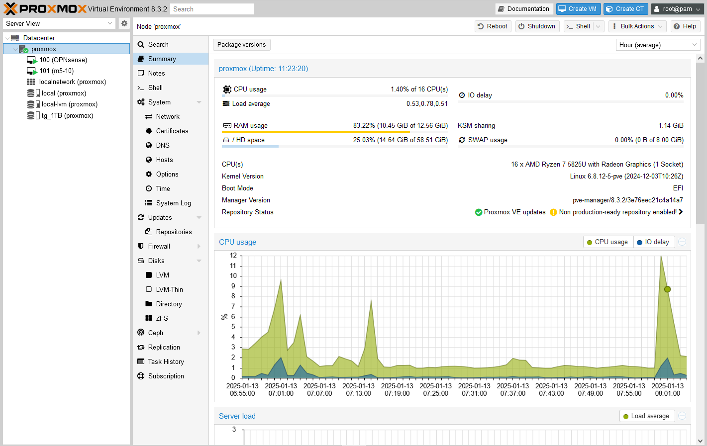
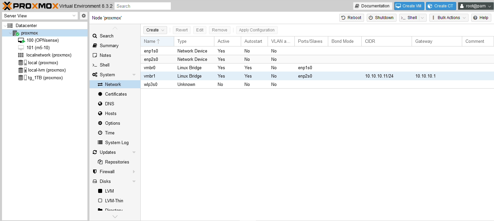
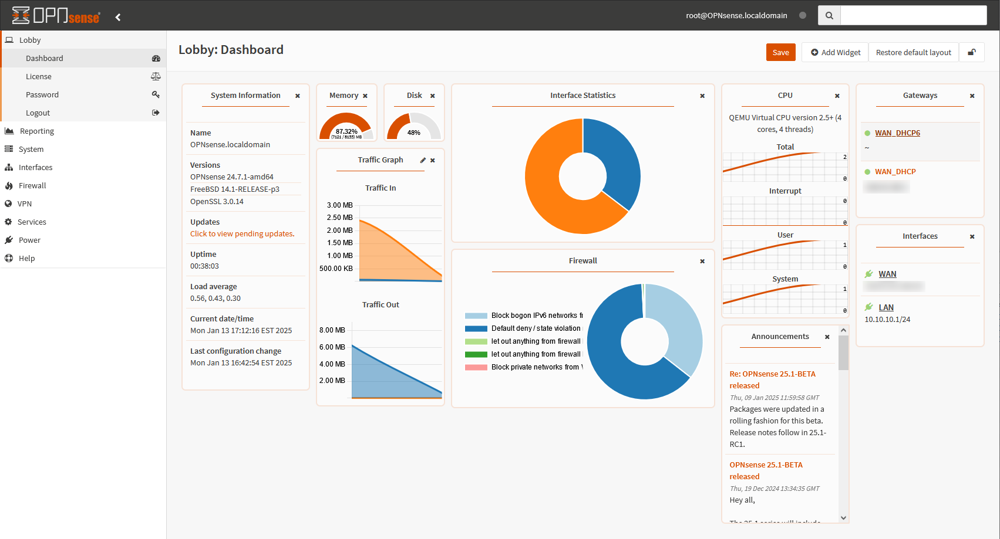

# GMKtec NucBox M5 Plus #
This is a record of setting up a Proxmox server with the M5 Plus for OPNsense router with mobile hotspot, portable NAS, and a portable workstation/gaming desktop.  
  
Currently running on Proxmox host (1x 512GB NVMe and 1x 1TB NVMe):  
* OPNsense router with Wifi AP using onboard MediaTek RZ616 Wifi and hostapd service
* OMV NAS
* Windows 10 with AMD Radeon Vega 8 PCI passthrough (Steam, Sunshine/Moonlight)  
  
## Motivation ##
I have a home server based on a used workstation hardware to serve as a central storage for all of my needs, including photos, films, data, documents and other digital backups. While this always-on, always online server is useful and allows me to access my entire storage online, sometimes portable storage can also be useful. There may be limited internet connection, or none at all when travelling. At the same time, a physical external storage relies on a physical connection which can become easily damaged especially when travelling while connected. I was therefore looking for a portable NAS, if you will, that is 1) portable, and 2) accessible wirelessly. Being accessible wirelessly also meant that multiple devices can access the storage at the same time.  

At a similar time, my router that also acted as a switch for all my devices was becoming unreliable. It would often hang every few days, requiring a physical reboot of the device. This became extremely inconvenient as I would lose access to my server, sometimes affecting my work where I had to rely on the data on the server which was too big or too inconvenient to be stored on my laptop (large, constantly updating dataset, progress and changes needing to be accessed across various devices). If I am to replace my router, I thought about why not spend a little more to build my own? It's not even more expensive than some of the more high-end wireless routers. In particular, Intel N100 based mini PCs offering dual or more 2.5G ethernet ports were plentiful.  

I thought to combine these two needs into one, and looked into mini PCs with multiple storage connectivity options. The mini PCs were quite small, comparable to portable 3.5 external storage drives in terms of bulkiness and weight. I discovered that you could spend slightly more for far higher computing power at the same time. The Ryzen 7 5825U is a powerful laptop CPU based on the Zen 3 architecture. It was first released in 2022, and with a TDP of 15W, it was quite efficient with power consumption that is slightly higher than the N100. Moreover, it could be configured for 45W TDP for more demanding workloads and was equipped with the Vega 8 iGPU which is quite capable on its own for gaming.  

The 5825U is overwhelming for a simple NAS, and an N100 is more than sufficient for it. But I couldn't waste the opportunity to spend a little more to get a lot better hardware. Also to make the most of it, I wasn't going to waste the computing power, and had a vague idea of also stuffing a portable gaming station as a VM, taking advantage of the Vega 8 iGPU, that can be played directly on the mini PC while travelling, or streaming to a mobile device. On this last role, I wasn't expecting it to work out flawlessly and I was unsure if passthrough of the APU was as doable as for discrete GPUs. It was a 'nice to have' and made my decision to purchase the hardware with tempered expectations. 

Thus, I started to set-up a 3-in-1 device. A router, portable NAS, and a portable workstation/gaming desktop. After a lot of research, I settled on the GMKtec NucBox M5 Plus based on its dual 2.5G ethernet, dual M.2 slots, extra m.2 slot for WiFi card, and the ability to power it with a powerbank using its USB PD port, making it trully portable and not reliant on a power plug.  

## The Set Up ##
We will start with Proxmox, a free virtualization host that I am most familiar, being the main OS of my home server. It's extremely versatile, and the broad userbase allows the user to find solutions to issues quite quickly. It is also essentially Debian underneath without significant changes, allowing the user to troubleshoot it like any other linux server and offering its innate flexibility to add components as necessary.  

## Specs ##
CPU: Ryzen 7 5825U (Zen 3 8-core 2.0 GHz/4.5 GHz)  
GPU: Radeon RX Vega 8 iGPU (8 CU)  
RAM: DDR4 SO-DIMM 2x16GB  
Storage: 2x PCIE M.2  
TDP: 15W (45W Performance Mode BIOS option)  
LAN: 2x 2.5G (Realtek RTL8125)  
Wireless: WiFi 6E (Mediatek MT7922 RZ616), Bluetooth 5.2  

## Proxmox ##
  

Proxmox VE helper scripts https://community-scripts.github.io/ProxmoxVE/  

Without specification during the installation process, Proxmox takes up the entire drive for its use. Since we will probably not be installing more than 3 VMs, even an entire 512GB drive just for Proxmox can be wasteful. I specified to use only 200GB of my primary 512GB NVMe and leave the rest of the disk empty. Resizing, especially reducing, the size of the Proxmox boot drive is extremely difficult and risky after installation due to the nature of using LVMs in Proxmox. It is much better to limit the initial disk size. If necessary, increasing the size later is much easier.  

Installation and setup of Proxmox is not different from any other hardware. I didn't need to install any special drivers. The only important point is deciding which of the two ethernet ports you will use for WAN and LAN. On my hardware, the ethernet ports appeared as `enp1s0` and `enp2s0`, from left to right. This appears during the installation process when setting the IP address for the device. I decided to use the left one as WAN and the right one as LAN. The main port selected is assigned to the virtual switch `vmbr0`. After installation, you will need to add another Liux Bridge at Proxmox -> System -> Network -> Create -> Linux Bridge, and assign the other ethernet port, which in my case was `enp2s0` for the brige `vmbr1`. It is through this LAN port that we will be accessing the management interface.  

  

As in any other Proxmox installation, or server for that matter, the hardware needs to be connected to a router in order for us to access the management interface. Once OPNsense is set up, we will need to switch some ethernet cables.


## OPNsense Router ##
  
Router + 2.5G switch

## Portable workstation/gaming desktop (Windows VM) ##
PCI passthrough

## Portable NAS ##

## Portable AP/Wireless Router ##
If using Windows VM: Mobile hotspot https://stackoverflow.com/questions/45833873/enable-windows-10-built-in-hotspot-by-cmd-batch-powershell  
  
After setting up OPNsense, we can now try to use the onboard MediaTek WiFi card to function as an AP. First, check if the card is recognized.
```
lspci -k | grep -A 3 -i mediatek
```

Then check if it has AP functionality. Proxmox doesn' have iw installed by default so install it first, as well as hostapd to run the AP. But stop hostapd running for now
```
apt install iw hostapd
systemctl stop hostapd
iw list | grep -A 10 "Supported interface modes"
```

Identify the name of the wireless interface. It was wlp3s0 for me.
```
iw dev
```

Bring up the interface
```
ip link set wlp3s0 up
```

Create directory and the config file
```
mkdir /etc/hostapd
vim /etc/hostapd/hostapd.conf
```

The config file should look like this
```
interface=wlp3s0
driver=nl80211
ssid=YourSSID
hw_mode=a
channel=36
ieee80211n=1
ieee80211ac=1
wmm_enabled=1
auth_algs=1
wpa=2
wpa_passphrase=YourStrongPassphrase
wpa_key_mgmt=WPA-PSK
rsn_pairwise=CCMP
bridge=vmbr1
```

This sets the SSID, channel, authentication method, and the bridge you connect the AP to (vmbr1). If you try to start the hostapd service now, it may fail to run giving this error:
```
wlp3s0: IEEE 802.11 Hardware does not support configured channel
```

This is likely due to regulatory restrictions on which frequencies or channels are allowed to be run depending on the country. When I received it first, it was set as Global, and some frequencies were disabled. You can check by
```
iw list | grep -A 20 "Frequencies:"
```

If the above command includes results such as below (No IR), it means they are disabled.
```
   Frequencies:
                        * 5180 MHz [36] (20.0 dBm) (no IR)
                        * 5200 MHz [40] (20.0 dBm) (no IR)
                        * 5220 MHz [44] (20.0 dBm) (no IR)
                        * 5240 MHz [48] (20.0 dBm) (no IR)
                        * 5260 MHz [52] (20.0 dBm) (no IR, radar detection)
                        * 5280 MHz [56] (20.0 dBm) (no IR, radar detection)
                        * 5300 MHz [60] (20.0 dBm) (no IR, radar detection)
                        * 5320 MHz [64] (20.0 dBm) (no IR, radar detection)
                        * 5500 MHz [100] (20.0 dBm) (no IR, radar detection)
                        * 5520 MHz [104] (20.0 dBm) (no IR, radar detection)
                        * 5540 MHz [108] (20.0 dBm) (no IR, radar detection)
                        * 5560 MHz [112] (20.0 dBm) (no IR, radar detection)
                        * 5580 MHz [116] (20.0 dBm) (no IR, radar detection)
                        * 5600 MHz [120] (20.0 dBm) (no IR, radar detection)
```

You can use ``iw reg get`` to check current regulatory status. You can then
```
iw reg set US
```

to set it to whichever jurisdiction you are in (US for United States). To persist this across reboots, at ``/etc/default/crda`` add
```
REGDOMAIN=US
```

You can now start the hostapd service
```
systemctl start hostapd
systemctl enable hostapd
```

Check `/etc/network/interfaces`
```
auto vmbr1
iface vmbr1 inet static
    address 192.168.1.1
    netmask 255.255.255.0
    bridge_ports enp1s0
    bridge_stp off
    bridge_fd 0
```

If you also find `iface wlp3s0 inet manual` within `/etc/network/interfaces`, **delete it.**  
Now, `ifreload -a` to reload this configuration within Proxmox. You should also be able to find this configuration within the Proxmox maintenance page at Datacenter -> proxmox -> System -> Network. This will now channel any connections to the wireless to the vmbr1 lan bridge. Since DHCP is handled by OPNsense, you don't need to do anything further.
